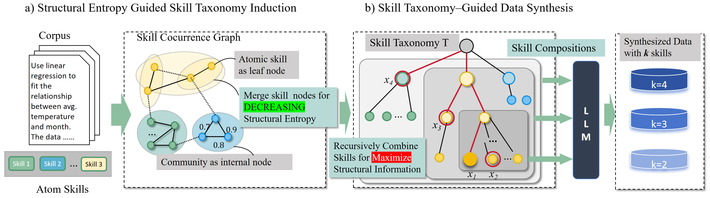

# Towards Compositional Generalization of LLMs via Skill Taxonomy Guided Data Synthesis

> A framework ( named STEPS ) improves LLM skill compositional generalization by using structural entropy and an Information Maximization strategy to synthesize a diverse yet coherent taxonomy of skill combinations.


## 🚀 **Highlights**
- ✅ **Skills: Finding the "Compositional Gap"**: LLMs are good at single skills (Atomic Skills), but they struggle when they need to combine multiple skills because those complex combinations are rare in training data.
- ✅ **Building a "Skill Map**: The researchers used **Structural Information Theory: ** to automatically group related skills into a hierarchical "map" (Taxonomy). Instead of picking skills randomly, STEPS used math to find skill combinations that provide the most "new information" (Structural Information Gain) to the model.
- ✅ **Data Synthesis: Quality Over Quantity**: The paper emphasizes that diversity should not be pursued without limit Through the recursive search strategy, the skill selection is restricted within the local subtrees of the classification tree and gradually expanded to higher levels. This constraint ensures that the synthesized skill set is both structurally challenging and maintains semantic coherence, avoiding noise caused by overly discrete skills
<p align="center">
  
</p>


## 🛠️ **Usage**

### 1️⃣ Install Dependencies  

**Step 1: Install Python packages**

```bash
pip install -r requirements.txt
```

**Step 2: Download Seed Data ([Infinity-Instruct](https://huggingface.co/datasets/BAAI/Infinity-Instruct))**

```bash
huggingface-cli download BAAI/Infinity-Instruct --repo-type dataset --include "Gen/*" --local-dir ./data
```

**Step 3: Set up your OpenAI API key**

```bash
export OPENAI_API_KEY="your-api-key-here"
export OPENAI_BASE_URL="your-base-url-here"
```

**Step 4: Prepare Evaluation Environment**

For specific assessment details, please refer to [ApacaEval](https://github.com/tatsu-lab/alpaca_eval) , [MT-Bench](https://github.com/lm-sys/FastChat/tree/main), and  [WildBench](https://github.com/allenai/WildBench)


### 2️⃣ Quick Start Example

#### **Execution Pipeline**

Please run the scripts in the following numerical order:

#### 1. Initial Skill Graph Construction

- **Script**: `1_construct_graph.py`
- **Description**: Extracts core skills from raw tasks or instructions (Infinity-Instruct) and establishes relationships between them to generate the initial **Skill Graph**.

#### 2. Skill Taxonomy Discovery & Combination

- **Scripts**: `2_get_tag_community.py` & `struct_entropy.py`
- **Theoretical Foundation**: Based on the principle of **Structural Entropy** minimization.
- **Description**:
  - Automatically identifies community structures within the skill graph using structural information theory.
  - Constructs a hierarchical **Skill Taxonomy**.
  - Generates strategic skill combinations based on structural connectivity to provide the logic for complex data synthesis.

#### 3. Skill-Based Data Synthesis

- **Script**: `3_openai_gen.py`
- **Description**: Utilizes LLMs (via OpenAI API) to synthesize instructions and training pairs based on the multi-skill combinations identified in Step 2.

#### 4. Curriculum Learning Scheduler

- **Script**: `4_curriculum_scheduler.py`
- **Description**:
  - Organizes the synthesized data according to a **Curriculum Learning** strategy.
  - Ranks data by difficulty and structural depth to optimize the model's post-training efficiency and stability.

#### 5. Skill Agent Bench Synthesis

- **Script**: `5_openai_gen_skills_agent.py`
- **Description**: Generates the **[SkillBench](https://huggingface.co/datasets/Weiyifan/SkillBench)**, a specialized evaluation suite designed to test model capabilities in tool invocation, planning, and multi-step reasoning in agentic scenarios.


## 📖 Citation

If you find this work helpful, please consider citing us:

```bibtex
@article{wei2026towards,
  title={Towards Compositional Generalization of LLMs via Skill Taxonomy Guided Data Synthesis},
  author={Wei, Yifan and Du, Li and Yu, Xiaoyan and Feng, Yang and Li, Angsheng},
  journal={arXiv preprint arXiv:2601.03676},
  year={2026}
}
```